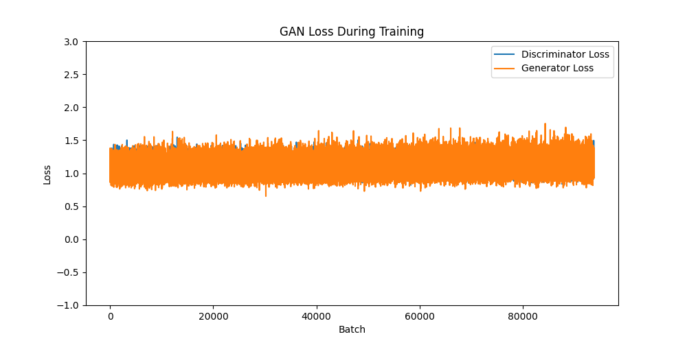

# GAN

## 📕 Description

This project implements a Generative Adversarial Network (GAN) to generate synthetic data, such as images, based on a given dataset. GANs consist of two neural networks, a generator and a discriminator, that compete against each other to improve the quality of generated outputs.

## ☝️ Features

- Implementation of a GAN architecture.
- Customizable generator and discriminator models.
- Training loop with loss visualization.
- Generation of synthetic images.
- Save and load model checkpoints.

## 🏗️ Project Structure

```bash
/gan
├── data/               # Dataset and data loading utilities
├── models/             # models definitions
│   ├── GAN.py
│   ├── discriminator.py
│   ├── generator.py
│   ├── weights/
│       ├── discriminator.pth
│       └── generator.pth
├── src/
│   ├── generate_images.py
│   ├── train.py
│   └── utils.py
├── README.md
├── .gitignore
└── requirements.txt
```

## 🫸 Prerequisites

- Python 3.8 or higher
- GPU with CUDA support (optional but recommended)

## 💾 Installation

1. Clone the repository:
   ```bash
   git clone https://github.com/Alfred0404/gan.git
   cd gan
   ```
2. Install dependencies:
   ```bash
   pip install -r requirements.txt
   ```

## ⚙️ Usage

1. Train the GAN:
   ```bash
   python training/train.py
   ```
2. View generated images in the `saved_figures/` directory.

## 📊 Statistics

### 🖼️ Generated Images

After training the GAN, the model is able to generate this type of images

<p align="center">
    
</p>

### 📈 Loss Curves

As the two models (generator & discriminator) are each training on the other, the loss is not meant to decrease. The loss remains stable. It doesn't mean that the gan is not learning, it means that the generator is getting better at generating images that fake the discriminator, and that the discriminator is getting better at spotting real and generated images.

<p align="center">
    
</p>

# 💻 Cuda support

Since pytorch supports cuda, you can run this project using your gpu.
Note that you can install cuda only if you have an nvidia gpu.

1. Install cuda with this [tool](https://pytorch.org/get-started/locally/)
2. Check the cuda version you need with
   `nvidia-smi`
3. Check your installed version
   `nvcc --version`
